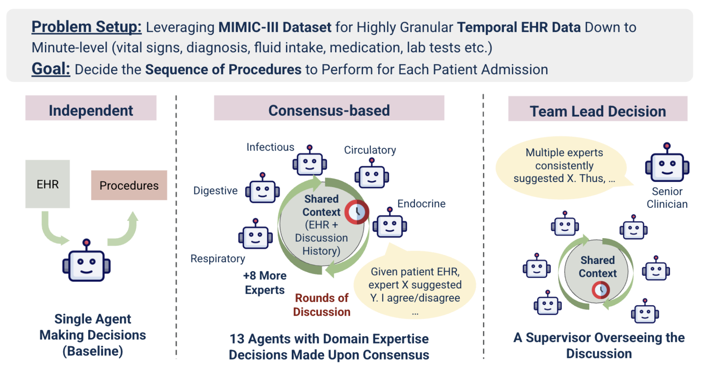

# Overview

This is the GitHub repo for the paper published at ACM Conference on Bioinformatics, Computational Biology, and Health Informatics (ACM-BCB 2025).

[Multi-Agent LLM Reasoning for Clinical Procedure Sequencing from High-Granularity EHR Data](https://dl.acm.org/doi/10.1145/3765612.3767238)

# Motivation
In real clinical environments, particularly in intensive care, medical procedures are rarely determined by a single physician. Instead, decisions emerge from collaboration among specialists who contribute their unique expertise. This project explores whether AI systems should mirror that collaborative structure rather than relying on a single monolithic model.

### Research question (RQ):
If multiple LLM agents are assigned distinct clinical specialties and reason collaboratively over a patient’s EHR, how accurately can they determine the sequence in which medical procedures should be performed?

# Design
Two agent topologies are studied. Consensus-based and leader-based. They are compared against a single agent baseline.

# Results

The order is evaluated at top-k precision and top-k recall. 

# Using the code

### Data and Model Access
Fill the API keys into the api_keys.json. 

> **Note:** Per the PhysioNet Data Usage Agreement, commercial entities such as OpenAI and Google are not permitted to access MIMIC-III data.
The results reported using GPT-4.1 were generated under an enterprise environment that complies with these requirements.

### Running configurations

Edit the configs near the top of `main.py` and run the script as the entry point.